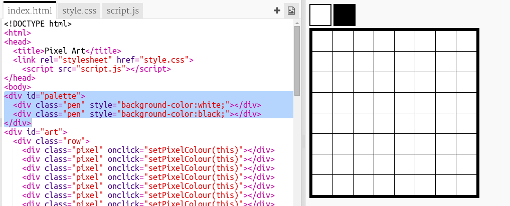

## Añade una paleta de colores

¿No te parece molesto que no puedas volver a cambiar el color de un píxel a blanco si te has equivocado? Vamos a arreglarlo creando una paleta de colores en la que puedas pulsar en un color para cambiar el color del lápiz. 

+ Empezaremos por crear un estilo de lápiz. 

	Añade el siguiente código al final del archivo `style.css`:

	

+ A continuación, crearemos lápices de color blanco y negro que usen ese estilo. 

	Añade el siguiente código en `index.html` después de `<body>`:

	

	`style=` nos permite añadir CSS dentro del HTML, lo que en este caso nos va muy bien. 

+ Podremos cambiar el color del lápiz cuando hagamos clic en un color de la paleta. 

	Las variables se usan para almacenar información. Vamos a crear la variable ColorLapiz en `script.js`.

	Añade el siguiente código en la parte superior del archivo:

	

	A continuación, añade una función para cambiar Colorlapiz:

	

+ También tendrás que usar el color del lápiz cuando quieras cambiar el color de un píxel. 

	Cambia la función `establecerColorPixel` para que use la variable `Colorlapiz` en lugar de `black` (negro):

	 

+ A continuación tendrás que llamar a la función `establecerColorLapiz` cuando se haga clic en el color de un lápiz. 

	Añade el código `onclick` marcado a los colores de tus lápices:

	

+ Prueba si puedes cambiar el color del lápiz entre blanco y negro, para colorear o borrar píxeles.
